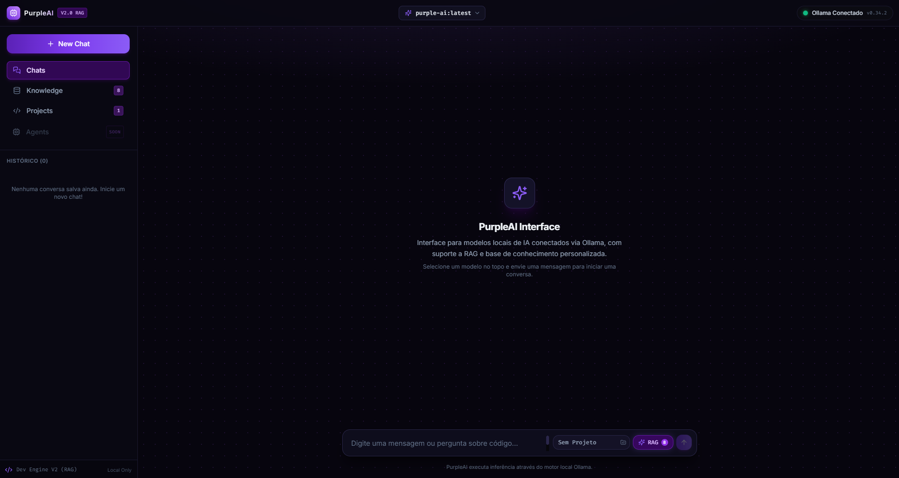
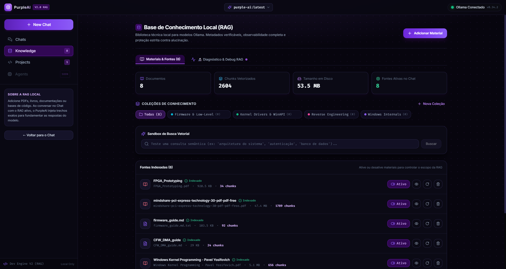
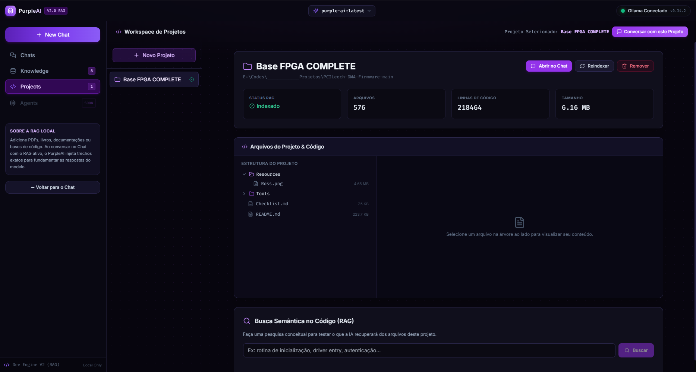

<div align="center">

# 🟣 PurpleAI Interface

**A Modern, Privacy-First Local AI Web Interface & Code Assistant powered by Ollama and RAG.**

[](LICENSE)
[](https://nodejs.org/)
[](https://ollama.com/)
[](https://react.dev/)
[](https://www.typescriptlang.org/)
[](https://vitejs.dev/)
[](https://tailwindcss.com/)

[Português](#-sobre-o-projeto) • [Features](#-features) • [Screenshots](#-screenshots) • [Quick Start](#-quick-start) • [Code Assistant](#-local-code-assistant--agent) • [Disclaimer](#-design--ai-slop-disclaimer)

---

</div>

## 📌 Keywords / SEO Tags
`Local LLM` • `Ollama Web UI` • `RAG (Retrieval Augmented Generation)` • `Local AI Assistant` • `Vector Search` • `AI Code Assistant` • `Private AI` • `Self-Hosted LLM` • `Offline AI` • `Developer Workspace` • `Open Source LLM Interface`

---

## 📖 Sobre o Projeto

O **PurpleAI Interface** é uma aplicação web completa, open source e autocontida para você rodar e gerenciar seus **modelos de linguagem locais (Local LLMs)** através do **Ollama**, sem depender de nuvem, sem assinaturas e com **100% de privacidade dos seus dados**.

Além de um chat com streaming fluido em tempo real, o PurpleAI inclui:
1. **Base de Conhecimento RAG (Retrieval-Augmented Generation)**: Faça upload de PDFs, notas em Markdown e códigos-fonte locais para enriquecer as respostas do modelo com dados da sua própria base vetorial.
2. **Workspace & Code Assistant (Agente de Modificação)**: Conecte pastas de projetos locais, visualize a árvore de arquivos, faça buscas semânticas no código e deixe a IA propor correções que você aplica diretamente no disco com **1 clique** (com backup de segurança automático).

> ⚠️ **Nota de Transparência:** Este projeto é 100% livre e foi desenvolvido para quem quer uma solução local e prática para criar seus próprios agentes e bases de conhecimento customizadas com Ollama.

---

## 📸 Screenshots

<div align="center">

### 💬 Chat com LLM Local e Streaming
*Interface limpa com streaming token a token, seletor de modelos e detecção do Ollama*


---

### 🧠 Base de Conhecimento & RAG Vetorial
*Upload de documentos técnicos, segmentação de texto (chunks) e busca semântica de alta velocidade*



---

### 🛠️ Workspace de Projetos & Modificação com 1 Clique
*Explorador de arquivos, visualizador com syntax highlighting e card interativo para salvar alterações no disco*



</div>

---

## ⚡ Principais Recursos

- 🔒 **100% Local & Privado**: Zero telemetria, zero requisições para servidores externos. Tudo roda no seu computador.
- ⚡ **Detecção Automática do Ollama**: Verifica status e sincroniza automaticamente a lista de modelos instalados (`llama3`, `qwen2.5-coder`, `deepseek-r1`, `mistral`, etc.).
- 🌊 **Streaming em Tempo Real (SSE)**: Respostas exibidas de imediato com cancelamento instantâneo via botão "Parar".
- 📚 **Motor RAG Embutido**:
  - Ingestão de arquivos `.pdf`, `.md`, `.txt`, `.c`, `.cpp`, `.rs`, `.py`, `.ts`, etc.
  - Chunking inteligente por parágrafos e funções de código.
  - Embeddings vetoriais locais e busca semântica por similaridade de cosseno.
  - Citações de fontes interativas no chat.
- 💻 **Assistente de Código & Modificador de Projetos**:
  - Gerencie projetos de código pelo caminho local.
  - Árvore interativa de diretórios e arquivos com leitor de código integrado.
  - Contextualização do projeto direto no prompt do modelo.
  - **Cards de Ação de Arquivos**: Quando o modelo sugere uma alteração ou novo arquivo, um botão interativo **"Aplicar Alteração"** salva o arquivo no seu disco e cria automaticamente uma cópia de segurança (`.bak`).
- 🎨 **Syntax Highlighting Completo**: Destaque de código com suporte a C, C++, Assembly (MASM/NASM), Rust, Python, Go, TypeScript, JSON, Bash e mais.
- 💾 **Persistência Atômica**: Histórico de chats, coleções e projetos salvos localmente em JSON de forma atômica.

---

## 🤖 Design & "AI Slop" Disclaimer

> **Sim, a interface visual deste projeto foi gerada com auxílio de Inteligência Artificial.**  
> Se você sentir aquela estética futurista clássica de "AI Slop" (muito neon roxo, gradientes cyberpunk e cartões translúcidos), agora você já sabe o motivo! 😄  
> O objetivo principal foi criar uma ferramenta funcional, rápida e gostosa de usar no dia a dia com foco total em usabilidade, contraste e legibilidade de código. Sinta-se livre para customizar os temas em `frontend/src/styles/theme.css`.

---

## 🚀 Quick Start (Como Rodar)

### 1. Pré-requisitos
- [Node.js](https://nodejs.org/) v18 ou superior instalado.
- [Ollama](https://ollama.com/) instalado e rodando na sua máquina.
- Pelo menos um modelo de chat e um de embedding baixados no Ollama:
  ```bash
  # Modelo de Chat recomendado (ótimo para código e raciocínio geral)
  ollama pull qwen2.5-coder
  # ou
  ollama pull llama3.2

  # Modelo de Embedding recomendado para o RAG
  ollama pull all-minilm
  ```

### 2. Clonar o Repositório
```bash
git clone https://github.com/seu-usuario/PurpleAI.Interface.git
cd PurpleAI.Interface
```

### 3. Instalar Dependências
```bash
npm install
```

### 4. Iniciar a Aplicação
```bash
npm run dev
```

Este comando iniciará concorrentemente:
- **Backend**: `http://localhost:3001`
- **Frontend**: `http://localhost:3000`

Abra seu navegador em:  
👉 **[http://localhost:3000](http://localhost:3000)**

---

## 🛠️ Modos de Uso

### 1. Chat Básico com Modelos Locais
Selecione qualquer modelo disponível no seu Ollama através do dropdown superior. Digite sua mensagem e receba a resposta em tempo real.

### 2. Usando a Base de Conhecimento (RAG)
1. Navegue até a aba **Base de Conhecimento** no menu lateral.
2. Crie uma coleção e faça o upload de documentos (PDFs técnicos, guias, manuais, etc.).
3. Ao conversar no chat com o botão **RAG** ativo, o assistente buscará os trechos mais relevantes dos seus documentos e fundamentará as respostas com base neles.

### 3. Usando o Workspace de Projetos (Code Assistant)
1. Acesse a aba **Projetos** e clique em **Novo Projeto**.
2. Digite o nome do projeto e o caminho absoluto da pasta no seu disco (ex: `C:\MeusProjetos\App`).
3. O PurpleAI indexará a árvore de arquivos e gerará a base semântica do seu código.
4. No chat, selecione o projeto no dropdown ao lado do botão RAG (ou clique em **"Conversar com este Projeto"**).
5. Peça para a IA explicar partes do código, encontrar bugs ou criar novas funções.
6. Quando a IA sugerir alterações, clique em **"Aplicar Alteração"** no card do arquivo para atualizar o arquivo no seu disco!

---

## 🏗️ Arquitetura do Sistema

```text
┌───────────────────────────┐         ┌───────────────────────────┐
│   Frontend (React + TS)   │         │    Backend (Express + TS) │
│                           │         │                           │
│  - Chat Area & Streaming  │ ◄─────► │  - SSE Stream Proxy       │
│  - FileActionCard (Diff)  │   SSE   │  - Safe File System I/O   │
│  - Projects Workspace     │   HTTP  │  - Chunker & Vector RAG   │
│  - Knowledge Manager      │         │  - Atomic JSON Storage    │
└───────────────────────────┘         └─────────────┬─────────────┘
                                                    │
                                                    ▼
                                      ┌───────────────────────────┐
                                      │    Ollama Local Engine    │
                                      │    (http://localhost:11434│
                                      │                           │
                                      │  - Chat Models (LLMs)     │
                                      │  - Embeddings (all-minilm)│
                                      └───────────────────────────┘
```

---

## ⚙️ Variáveis de Ambiente (Opcional)

Caso queira customizar portas ou o endereço do Ollama, você pode criar um arquivo `.env` no `backend/`:

```env
PORT=3001
HOST=0.0.0.0
OLLAMA_HOST=http://localhost:11434
EMBEDDING_MODEL=all-minilm
```

---

## 🤝 Contribuições

Contribuições são super bem-vindas! Sinta-se livre para abrir uma **Issue** ou enviar um **Pull Request** com novas ideias, melhorias de desempenho ou integrações.

---

## 📄 Licença

Distribuído sob a licença **MIT**. Veja o arquivo [LICENSE](LICENSE) para mais detalhes.
